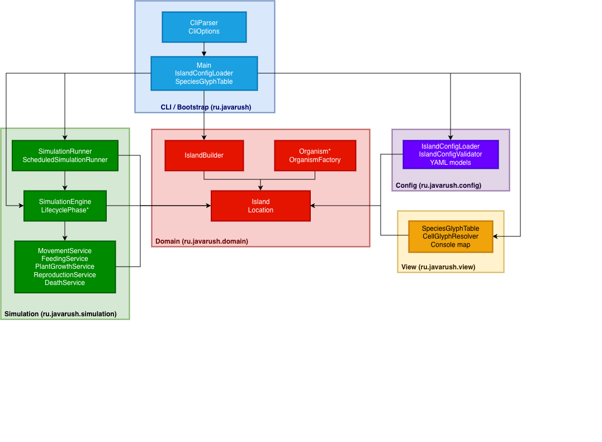
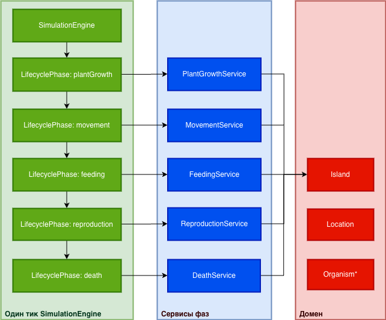
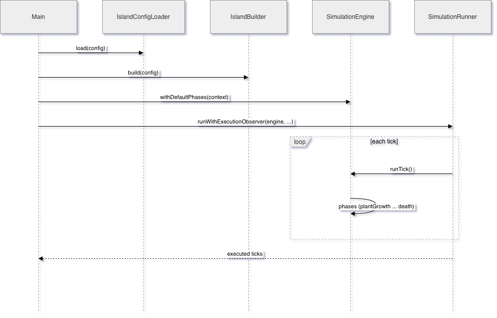

# Архитектура Island Simulation

- **Слои:** `config` (YAML + валидация) → `domain` (остров, сущности) → `simulation` (фазы тика, сервисы) → `view` (карта); `Main` — сборка графа (composition root) и CLI.
- **Data-driven:** поведение и числа вынесены в `island.yml` (виды, диета, размеры), код не зашит константами сценария.
- **Один тик:** конвейер фаз `plantGrowth → movement → feeding → reproduction → death`; стоп по `StopCondition` или лимиту тиков.
- **Многопоточность:** опционально `parallel` Stream по строкам сетки при планировании движения/роста; применение плана к острову — в одном потоке. Режим `--scheduled` — один поток планировщика, тики не параллелятся.
- **Паттерны:** Factory (`OrganismFactory`), Builder (`IslandBuilder`), конвейер фаз (Template/pipeline), без избыточного слоя «стратегий» на каждый `if`.

## Структура

| Пакет | Ответственность |
|--------|-----------------|
| `ru.javarush` | Точка входа (`Main`), CLI (`CliParser`, `CliOptions`) — **composition root**: собирает объекты, не содержит бизнес-логики тика. |
| `ru.javarush.config` | Модели и загрузка YAML, валидация конфигурации до запуска. |
| `ru.javarush.domain` | Остров, клетки, организмы, фабрика/билдер — **доменная модель** без знания о консоли и CLI. |
| `ru.javarush.simulation` | Фазы тика, сервисы (движение, питание, …), движок и раннеры — **прикладная логика симуляции**. |
| `ru.javarush.view` | Отображение карты (глифы по видам) — тонкий слой над доменом. |

Идея: **зависимости направлены внутрь** — к домену и симуляции; `Main` зависит от всех слоёв, но домен не зависит от `simulation` и `view`.

## Компоненты

Поток одного тика (упрощённо):

Каждая фаза реализует общий контракт `LifecyclePhase` и использует соответствующий *Service* (или логику внутри фазы — в зависимости от класса).

## Принятые проектные решения

1. **Конфигурация из YAML, не константы в коде** — меньше перекомпиляций, проще сценарии. Валидация в `IslandConfigValidator` до старта, чтобы не ловить «битые» числа в середине симуляции.

2. **Ручная сборка графа** — осознанное ограничение ТЗ: в `Main` видно порядок создания `Random`, `IslandBuilder`, `SimulationEngine`, раннера. Это **composition root**;

3. **Фазы тика как отдельные классы** — проще тестировать и добавлять шаги, чем один `if` после другого в одном методе на сотни строк.

4. **Параллельное планирование (опционально)** — только там, где считаются планы по строкам; **применение** к острову остаётся последовательным, чтобы не ловить гонки по общим коллекциям.

5. **Детерминизм через `Random` с seed** — воспроизводимые прогоны для отладки и тестов.

6. **Карта в консоли** — отдельно `SpeciesGlyphTable` + `CellGlyphResolver`, чтобы не смешивать выбор символа с логикой еды/движения.

## Паттерны

| Идея | Где проявляется |
|------|-----------------|
| **Factory** | `OrganismFactory` — создание организма по `speciesId` и настройкам из конфига. |
| **Builder** | `IslandBuilder` — пошаговое заполнение острова из конфигурации. |
| **Template / pipeline** | `SimulationEngine` выполняет фазы в фиксированном порядке; сами фазы — отдельные типы. |
| **Strategy** (частично) | Разные реализации фаз (`LifecyclePhase`) и разные раннеры (`SimulationRunner` vs `ScheduledSimulationRunner`) — **без** отдельного интерфейса «стратегия тика» для каждой мелочи: это было бы избыточно для текущего размера проекта. |
| **Composition root** | `Main` — только wiring и вывод; логика тика не «висит» в `main`. |

Таким образом реализуется **разделение ответственности** и **один разумный уровень абстракции** на слой.

## Диаграмма последовательности

